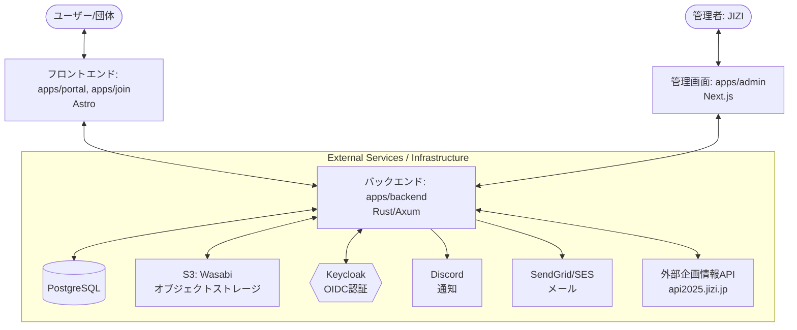

# システムアーキテクチャ (Architecture)

本システムは，Nxを利用したモノリポ構成を採用しており，フロントエンド・バックエンド・ドキュメントが単一のリポジトリで管理されています．

## 論理構成図

## フロントエンド (`apps/portal`, `apps/admin`, `apps/join`)

### 技術スタック
- **Framework**: Astro / Next.js (TypeScript)
- **State Management**: React Context / Hooks

### 特徴・配信手法
- **静的配信**:
  各フロントエンドアプリのビルド時に HTML/JS/CSS を生成します．

## バックエンド (`apps/backend`)

### 技術スタック
- **Language**: Rust
- **Web Framework**: Axum (Tokio stack)
- **ORM**: SeaORM (PostgreSQL)

### 内部構造 (Layered Architecture)
バックエンドは以下の役割ごとにレイヤー化されています．

1. **Routes (`src/routes`)**:
   HTTPエンドポイントの定義とリクエストのハンドリング．
2. **Middlewares (`src/middlewares.rs`)**:
   認証・認可，ロギングなどの共通処理．
3. **Entities (`src/entities`)**:
   ビジネスロジックの中核．データのバリデーションや複雑な操作を担当．
4. **SeaORM Entities (`src/sea_orm_entities`)**:
   データベーススキーマと1対1に対応するモデル（自動生成を含む）．
5. **Services (`src/service`)**:
   Discord連携などの外部サービス用クライアント．
6. **Utils (`src/util`)**:
   JWT操作，ハッシュ計算，OIDCクライアントなどの共通ユーティリティ．

### 認証の仕組み
本システムでは，対象ユーザーに応じて2種類の認証方式を併用しています．

- **管理者 (JIZI)**:
  KeycloakによるOIDC認証を行います．ログインに成功すると管理者権限が付与されます．
- **参加団体 (Groups)**:
  バックエンドが独自に発行するJWTを使用して認証します．初回ログイン時にアクティベーションを行う形式です．

## インフラ・外部連携

### データの永続化
- **PostgreSQL**: 団体情報，申請データ，お知らせ，ユーザー情報などの構造化データを管理します．
- **S3 (Wasabi)**: 団体がアップロードした資料や，配布資料のPDFファイルなどを格納します．

### 外部連携
- **外部企画情報API (`api2025.jizi.jp`)**:
  既存の企画管理システムと連携し，企画情報の同期や更新（承認後の反映など）を行います．
- **通知連携**:
  - **Discord**: 承認申請が行われた際など，実行委員への通知に使用します．
  - **SendGrid / Amazon SES**: ユーザーへのメール通知に使用します（Amazon SESに移行予定）．
